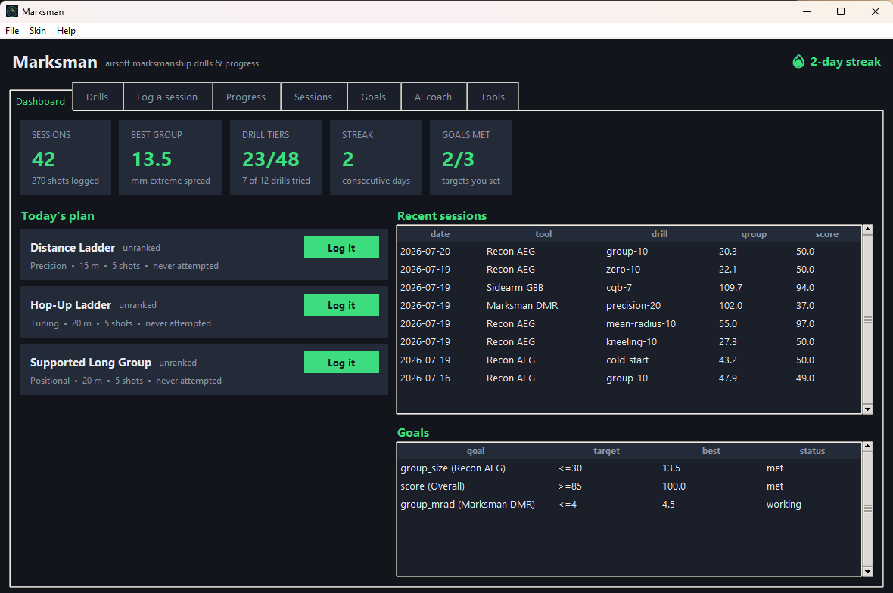
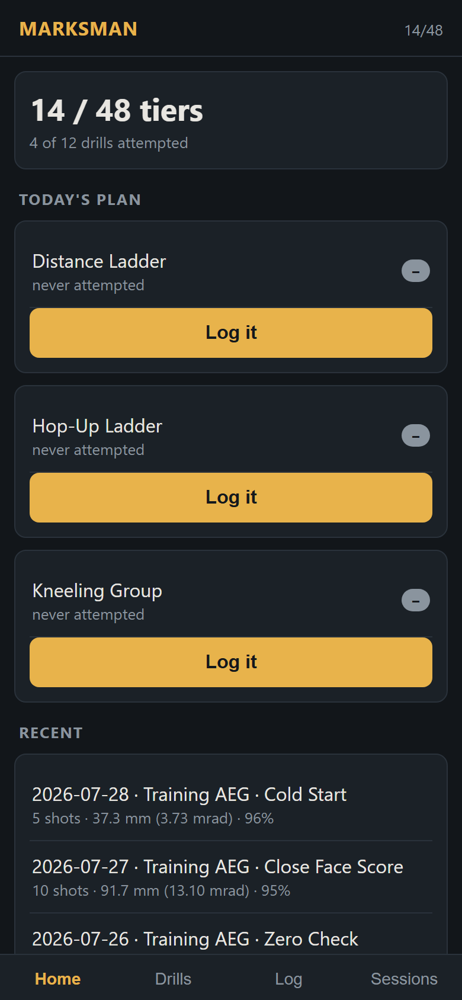
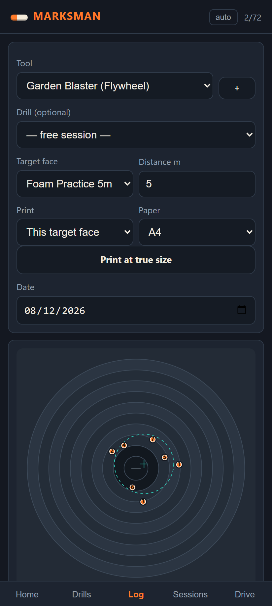

# Marksman


[](https://github.com/adervec/MarksmanApp/actions/workflows/ci.yml)

**Get better at hitting things with foam darts.** Marksman **analyses a
marked-up photo of a target** (where your darts actually landed) into precise
marksmanship metrics, judges them against **tiered practice standards**, and
**tracks your progress over time** — overall, by blaster **category**, and by
**specific blaster**. It also **prints the target faces** it scores against, at
true physical size, so you have something to shoot at. Desktop app,
**phone-friendly web app**, **Google Drive sync**, and a full CLI.

Foam darts are what it ships for and what it looks like. Under that, the engine
is deliberately **equipment-agnostic** — it knows about *tools* that launch
*projectiles* at *target faces*, and nothing else. Drills, faces and vocabulary
all come from [**equipment packs**](#equipment-packs), plain JSON files: foam
dart blasters is the one that ships enabled, airsoft comes with the repo as an
optional install, and you can write a pack for whatever you practise with. **You are responsible for what you install and for whether
it is legal and safe where you are.**

> **Independent project.** Marksman is not affiliated with, sponsored by, or
> endorsed by any blaster, toy or equipment manufacturer. The name, logo,
> artwork and packs are original work, and no brand, product line or model is
> named anywhere in it — see
> [THIRD_PARTY_NOTICES.md](THIRD_PARTY_NOTICES.md).

It is pure Python standard library: **no third-party packages required**
(works on Python 3.9+). Image analysis reads PNG out of the box; if Pillow
happens to be installed, JPEG and other formats work too.



> ⚠️ **Disclaimer — please read.** Marksman is a hobby project by a software
> developer — **not** a coach, instructor, doctor, or lawyer. It computes
> metrics for **personal progress tracking only**; it is **not** coaching,
> safety, medical, or legal advice, and **not** an official scoring system.
> **Anything that launches a projectile can injure someone: always wear eye
> protection, follow the rules of wherever you are shooting, and obey your
> local laws.** Equipment packs are content written by whoever wrote them —
> their drills and standards are somebody's opinion, not this app's, and are
> not checked by it. Provided "as is", with no warranty. Full text:
> **[DISCLAIMER.md](DISCLAIMER.md)**.

## The desktop app

```bash
marksman gui          # or: python -m marksman gui
```

Eight tabs over the same data the CLI uses — tkinter, so it needs nothing
installed:

| Tab | What's in it |
|---|---|
| **Dashboard** | Stat cards (sessions, best group, tiers, streak, goals), **today's adaptive plan**, recent sessions, goals at a glance. |
| **Drills** | The whole catalogue with your tier on each, plus how to run it, the cues, and the four standards. |
| **Log a session** | The target face drawn to scale — **click your shots onto it** (right-click removes) and watch group size, mrad/MOA, mean radius, zero error, **which way to move your sight** and score update live. Or load a photo and let the vision layer find the hits. **Print face…** opens the face at true size. |
| **Progress** | Line charts of any metric, scoped to overall / a tool / a category / a single drill, with the trend table beside it. |
| **Sessions** | Every session; render a diagram or delete one. |
| **Goals** | Set, track and remove your own targets. |
| **AI coach** | Write the cowork folder and pull the reply back in — one button each. |
| **Tools** | Add and remove your tools. |

Every terminal **skin** has a matching desktop palette (**Skin** menu).

## On your phone

The same data in any browser on your Wi-Fi — log shots at the field by
**tapping them onto the target face**:

```bash
marksman web          # then open the printed URL on your phone
```

<p>


</p>

Five tabs: **Home** (tier points, today's plan, goals you can set and clear,
recent sessions, installed packs and their safety notes), **Drills** (the
catalogue with your standings), **Log** (tap-to-place shots -- or type the
coordinates, which is also the keyboard route -- with live group stats,
sight-correction advice, a **Print at true size** button for the face or any
drill sheet from the catalogue, drill prefill, add-a-tool), **Sessions** (a **trend chart** per metric and per
tool, delete a session, export CSV/JSON) and **Drive**. Served by the standard
library's `http.server` — still zero dependencies, and it works in a desktop
browser too.

**Add it to your home screen** and it opens like an app — its own icon, no
browser chrome. The access code stays the same between runs so the icon keeps
working; `marksman web --new-key` issues a fresh one and invalidates the old
links.

The header's orientation toggle (**auto / portrait / landscape**) locks the
layout by *setting*, not by how the phone happens to be tilted — handy when
the phone is lying flat next to the target.

## Google Drive

The **Drive** tab does two separate things, sharing one sign-in:

- **Sessions across devices** — your log syncs through Drive's private
  app-data folder, which only this app can see. Nothing else in your Drive is
  touched. Python owns the merge (union by id, local wins ties), so the phone
  and the desktop converge.
- **Target photos** — photograph your targets into a Drive folder, paste the
  folder link, and tap a photo. Marksman downloads it, finds the hits, and drops
  them onto the target face on the **Log** tab so you can correct them before
  saving. The saved session remembers which photo it came from, so already-logged
  photos are greyed out in the picker — and because that lives on the session,
  it survives sync and export.

Auth runs in the browser using Google Identity Services with the same public
OAuth client as [Tachyread](https://github.com/adervec/Tachyread) and
HandwritingHelper. It's an identifier, not a secret: it only works from the
JavaScript origins registered with Google, and the app refuses it on any other
origin. Access tokens live in memory and are never written to disk.

> **You will probably need to register your address.** Google only allows
> sign-in from origins registered against the client ID. Add
> `http://localhost:8317` (and `http://127.0.0.1:8317`) under *Authorized
> JavaScript origins* for that client, or paste your own client ID into the box
> at the bottom of the Drive tab. The tab tells you what this page's origin is.

The printed URL carries an access code, so only someone with the full link can
view or add sessions. It is meant for your home network — **don't port-forward
it to the internet.**

## What it measures

From a set of hits it computes the standard measures used to judge a group:

| Metric | Meaning |
|---|---|
| **Group size (extreme spread)** | Largest centre-to-centre distance — the headline "group size". |
| **Mean radius** | Average distance of hits from the group centre — a stable precision measure. |
| **RMS radius / CEP / σx, σy** | Further precision descriptors. |
| **Zero error (POA–POI)** | How far the group centre sits from your point of aim (sight/hop zero). |
| **Score** | Points off the target's rings, with optional decimal (tenths) scoring and "edge breaks the line" projectile-size handling. |

Group size is also reported as an **angle** (mrad / MOA) using the distance, and
score as a **percentage of maximum**, so sessions at different distances and on
different target faces can be compared on equal terms.

### Which way to move the sight

A zero error is only useful if you know what to do about it, so every analysis
ends with the correction — *"move the group 12 mm left and 8 mm up"*, in mrad
and MOA once it knows the distance. Give a tool the click value written on its
turret and it counts the clicks for you:

```bash
marksman tool add --id r1 --name "Sighted blaster" --click 1/4moa  # or 0.1mrad
marksman tool set --id r1 --click 0.1mrad     # change it later; '' clears it
marksman analyze --tool r1 --distance 10 --shots "12,8 14,10 13,6"
#   Sight correction  : Move the group 18 clicks left and 11 clicks down at 10 m
```

It is arithmetic on your own group, not coaching: it assumes the sight moves the
group the way its markings say, and it cannot know about a canted mount, a bad
rest, or how your projectile actually flies. Tools without an adjustable sight simply leave `--click` off and
get millimetres and angles.

## Printing a target

The rings are only worth measuring if the paper you shoot matches the face the
app scores against, so Marksman prints its own — at **true physical size**:

```bash
marksman targets --print "Foam Practice 5m" --distance 5        # opens a browser
marksman targets --print "Practice Face" --paper a3 -o face.html --no-open
```

It writes a page of SVG in millimetre units and hands it to your browser's print
dialog, which is also how you get a PDF. Faces bigger than the paper are **split
across sheets** with alignment marks to tape together (`--paper` takes `a4`,
`letter`, `a3`, `a5`, `legal`, `tabloid`, or a custom `WxH` in mm).

Every sheet carries a **100 mm ruler**: measure it after printing. If it isn't
100 mm, your printer scaled the page — print again at 100% / "actual size", not
"fit to page". The same button is on the desktop app's Log tab and the phone
app's Log tab.

### The drill-sheet catalogue

Beyond the scoring faces there is a **parametric catalogue** of practice
sheets — a family name plus a size in millimetres, any size, any paper, so the
selection is effectively unlimited:

```bash
marksman targets                       # lists the families under the faces
marksman targets --print dots-15       # rows of 15 mm aiming dots
marksman targets --print bulls-40      # a grid of 40 mm bulls
marksman targets --print grid-10       # sight-in graph paper, 10 mm squares
marksman targets --print clock-25      # twelve bulls in a circle, call and hit
marksman targets --print ladder-50     # shrinking bulls, big to small
marksman targets --print face-120      # a real scored bullseye at 120 mm
marksman targets --print face-600 --paper a3   # tiled across sheets
```

Ten families — `face`, `bulls`, `dots`, `squares`, `diamonds`, `grid`,
`clock`, `ladder`, `lines`, `cards` — each at whatever size fits your paper.
The phone app's Log tab has the same catalogue in its **Print** dropdown.

## Install

It runs straight from the source tree — no install needed. To get a `marksman`
command on your PATH, pick one:

```bash
pipx install .        # isolated, recommended
pip install --user .  # or into your user site-packages
pip install -e .      # editable (for hacking on it)
```

Once installed, run `marksman ...` for the CLI or `marksman-gui` for the desktop
app; without installing, `python -m marksman ...` works from the source tree.
(`python -m marksman.cli ...` also still works.)

**Windows one-click:** `install.ps1` installs the command, generates the icon,
and adds a Start Menu shortcut that **opens the app** (add `-Desktop` for a
desktop one too):

```powershell
powershell -ExecutionPolicy Bypass -File .\install.ps1
```

Your data lives in a single `marksman_data.json` (the shortcut opens in
`%USERPROFILE%\Marksman`).

## Quick start

```bash
# 0) Prefer clicking to typing? Everything below is in the desktop app too.
python -m marksman gui

# 1) Register a blaster (or whatever you shoot -- it's all "tools" inside)
python -m marksman.cli tool add --id d1 --name "Garden Blaster" \
    --category "Flywheel" --projectile "13mm foam dart" --projectile-mm 13.0

# 2a) Analyse a photo/scan where each hit is marked with a red dot/circle.
#     The image spans the target face; find the bull automatically.
python -m marksman.cli analyze --tool d1 --target "Foam Practice 5m" \
    --distance 5 --image my_target.png --color red --auto-center

# 2b) ...or just type the shot coordinates (mm from point of aim):
python -m marksman.cli analyze --tool d1 --target "Foam Practice 5m" \
    --distance 5 --shots "12,34  -20,51  5,-10"

# 2c) ...or shoot a named drill, which brings its own distance and target face
python -m marksman.cli drill plan               # what to practise today
python -m marksman.cli analyze --tool d1 --drill foam-group-5 \
    --shots "80,20 -60,40 10,-70 -30,50 40,10"  # prints the tier you earned

# 3) Track progress
python -m marksman.cli progress                 # overall
python -m marksman.cli progress --by-category
python -m marksman.cli progress --by-tool
python -m marksman.cli progress --tool d1 --sessions
python -m marksman.cli sessions                 # list every saved target
python -m marksman.cli targets                  # built-in target faces

# 3b) Print the face you are shooting at, at true size
python -m marksman.cli targets --print "Foam Practice 5m" --distance 5

# 4) Pick a skin (see "Skins" below)
python -m marksman.cli theme                    # list skins
python -m marksman.cli theme preview inferno    # try one on
python -m marksman.cli theme set recon          # make it the default

# 5) Save space: recreate results as diagrams, then delete bulky source media
python -m marksman.cli render --tool d1       # redraw from stored shots
python -m marksman.cli cleanup --tool d1      # dry run (add --apply to delete)
```

## Analysing an image

Mark each hit on the target (a coloured pen dot or ring around each impact is
the most reliable). Then:

* **Detection** — `--mode marker` finds the coloured marks (`--color
  red|green|blue|orange|purple|yellow`, or `--rgb r,g,b`). `--mode holes`
  detects dark impact marks directly on a clean scan.
* **Where the centre is** — `--center X,Y` (pixels), or `--auto-center` to use
  the dark bull, or it defaults to the image centre.
* **Scale (mm per pixel)** — one of `--mm-per-px`, `--reference "x1,y1 x2,y2
  mm"` (two points a known distance apart), or `--face-width MM` (the image
  spans a target face that wide). If you pass a `--target`, its known face
  width is used as a fallback.

## AI coach (cowork folder)

Marksman can hand your progress to an AI coach through a **folder** — no API key,
no network calls from the app. It writes a request folder; a
[Claude Code](https://claude.com/claude-code) agent (or any Claude chat) reads it
and writes back a `reply.json`; you pull that reply back in.

```bash
marksman coach export        # writes coach/ : request.json, request.md, CLAUDE.md
# → point a Claude Code agent at coach/ (it reads CLAUDE.md), or paste
#   coach/request.md into any Claude chat. It saves coach/reply.json.
marksman coach apply         # ingest the reply: analysis, a focus, drills, tips
marksman coach show          # read the latest coaching any time
```

The request bundles the full progress dataset — group sizes (mm and mrad), score
%, zero error, per-tool and per-category trends, recent sessions, your **drill
tiers** and what the plan would pick next, your goals, and your current practice
**streak** — so the coaching is grounded in your actual numbers. It is
practice feedback only, never coaching-certification, medical, or safety advice.

## Drills

A drill has a distance, a shot count, a target face, and one metric it is judged
on — plus **four tiers**: `Rookie → Steady → Sharp → Marksman`. Your **best**
attempt sets the tier, so a bad day never demotes you.

```bash
marksman drill                       # the catalogue + your tier on each
marksman drill --family Precision    # one family
marksman drill show foam-distance-8  # why, how to run it, cues, standards
marksman drill plan                  # what to practise today, and why

# Log an attempt -- the drill supplies the distance and target face
marksman analyze --tool b1 --drill foam-group-5 --shots "8,2 -6,4 1,-7 -3,5 4,1"
```

The drills themselves come from whichever **equipment packs** you have installed
(see below) — the app supplies the tiering, the personal records and the plan,
not the content. The two bundled packs give you 18 drills across families like
Zeroing, Precision, Tuning, Speed, Fundamentals, Positional and Consistency.

`drill plan` is **adaptive**: it surfaces drills you've never tried, ones you're
within reach of the next tier on, ones going stale, and ones trending the wrong
way — and tells you which reason applied. The standings and the plan ride along
in the coach export too.

> Tiers are practice standards set by **whoever wrote the pack** — a visible
> next rung, not an official classification of any kind.

## Equipment packs

Marksman itself knows nothing about any particular kind of shooting. It knows
about **tools** that launch **projectiles** at **target faces**. Everything with
a subject matter — what the tool is called, which faces exist, what the drills
are — lives in a **pack**: a plain JSON file the app reads at startup.

```bash
marksman pack list             # what's installed, and what's loading
marksman pack show foam        # drills, faces, categories, safety notes
marksman pack install ./my-pack.json
marksman pack disable foam
```

One ships enabled, and it is an ordinary pack with no special privileges:

| Pack | Sensitivity | What's in it |
|---|---|---|
| **Foam Dart Blasters** | 1 · Toy | 6 drills, 2 faces, sized for how wide a foam dart actually spreads |

A stock install therefore speaks one vocabulary -- blasters and darts. The repo
also carries an **Airsoft** pack (2 · Sport; 12 drills, 3 faces, for AEGs, GBBs,
spring, HPA and bolt-action) which is *not* installed by default. If you want
it:

```bash
marksman pack install packs/airsoft.json
```

It is not in the wheel either, so a PyPI install needs the file from
[`packs/`](https://github.com/adervec/MarksmanApp/tree/main/packs) in this repo first.

Install a second pack and the vocabulary goes back to neutral ("tool",
"projectile"), because two packs no longer agree on what to call things.

### Writing your own

A pack is data, never code — it is read with `json.load` and nothing else, so an
installed pack can't execute anything. Drop it in `~/.marksman/packs/` (or set
`MARKSMAN_PACKS`), or run `marksman pack install`. A pack with the same `id` as
a bundled one replaces it, and a malformed one is reported by name rather than
breaking the others.

```json
{
  "schema_version": 1,
  "id": "slingshot",
  "name": "Slingshots",
  "sensitivity": 2,
  "safety": "Eye protection. Never at people or animals.",
  "terms": {"tool": "slingshot", "projectile": "ammo"},
  "categories": ["Flatband", "Tubular"],
  "targets": [{"name": "Can Line 8m", "ten_ring_mm": 60,
               "ring_step_mm": 30, "face_mm": 600}],
  "drills": [{
    "id": "sling-8", "name": "Eight-Metre Group", "family": "Precision",
    "distance_m": 8, "shots": 10, "target": "Can Line 8m",
    "metric": "group_size", "cutoffs": [300, 220, 150, 90],
    "why": "The headline number.",
    "how": ["Braced stance, ten shots, one aiming point."],
    "cues": ["Same anchor point every draw."]
  }]
}
```

`metric` is one of `group_size`, `group_mrad`, `mean_radius`, `zero_error` or
`score`; the four `cutoffs` must get harder in the right direction for it, and
that's checked on load. If exactly one pack is active, its `terms` rename things
throughout the app; with several installed the neutral words are used, because
calling a dart a BB would be worse than saying "projectile".

### Sensitivity

Every pack declares how regulated or contentious its subject is, 1–5. A pack
above your **ceiling** is found and listed but **not loaded** until you raise it
on purpose:

```bash
marksman pack ceiling          # the ladder, and where you sit
marksman pack ceiling 3        # raise it deliberately
```

The ceiling starts at **2**, so a fresh install only ever loads recreational
content. Both bundled packs sit at or below it. Raising it prints what you're
taking on, and each active pack's own safety text is shown in the app.

> Packs are content written by whoever wrote them — **not** by this app, and not
> checked by it. Their drills, distances and standards are somebody's opinion.
> You are responsible for obeying the law where you live and for handling
> whatever you own safely.

## Goals

Set a target for one metric — overall or for a specific tool — and track it. A
goal is "met" once your **best** session for that scope crosses the target.

```bash
marksman goal set --metric group_size --target 30 --tool b1   # <= 30 mm group
marksman goal set --metric score --target 80                    # >= 80% overall
marksman goal list                                              # progress + status
marksman goal rm <id>
```

Metrics: `group_size`, `group_mrad`, `mean_radius`, `zero_error`, `score`. Any
goals you set ride along in the coach export, so the AI coach steers its focus
toward what you're chasing.

## Export your data

```bash
marksman export --format csv --out sessions.csv   # one row per session
marksman export --format json                     # to stdout (pipe it)
```

Both are **reports** — one flattened row per session, for a spreadsheet. The
backup is the database file itself (`marksman_data.json`): copy it wherever you
like. To put one back, or to fold a second machine's history into this one:

```bash
marksman import ~/backups/marksman_data.json --dry-run   # what would be added
marksman import ~/backups/marksman_data.json
```

It merges by id and never overwrites what you already have, so running it twice
does nothing the second time. It also accepts the bundle the Drive tab syncs,
which is how you restore from Drive without a browser.

## Logo / icon

Regenerate the app icon any time (pure Python — no image libraries):

```bash
marksman logo --out assets --size 512   # → assets/marksman.png + marksman.ico
```

## Skins

The reports can wear a **skin** — a colour palette plus a little texture
(sparkline ramp, rule character, marker glyph). Every skin is an original name
with its own palette; pick whichever mood you like:

| Skin | Palette / vibe |
|---|---|
| `mono` | **Iron Sights** — A clean printed score card -- no colour, just the numbers (the default: no colour at all, so piped output stays plain) |
| `foam` | **Foam Dart** — Safety orange and foam cream over a soft teal — the house style, worn by the desktop and phone apps |
| `garden` | **Garden Skirmish** — Cut grass, sunshine and a bright dart streak |
| `blockfort` | **Block Fort** — Cardboard walls, parcel tape and foam-tipped darts |
| `recon` | **Glow Dark** — Glow-in-the-dark green under a warm amber |
| `orbital` | **Orbital** — Blue HUD with green and holographic amber |
| `inferno` | **Hot Streak** — A molten red run into bright orange |
| `frontline` | **Sideline** — Team-jersey blue cut with a whistle orange |
| `lightfall` | **Light & Dark** — Deep purple lit by golden light |
| `pandora` | **Cel-Shade** — Bold comic yellow with inky outlines |
| `dust` | **Sandlot** — Backyard sand against a cool pool blue |
| `overdrive` | **Overdrive** — Vibrant orange energy over bright cyan |
| `dropzone` | **Bunker** — Team red on cool concrete grey |
| `tropic` | **Back Garden** — Lush green teal under a sunset orange |

```bash
marksman theme                    # list skins (current one marked)
marksman theme preview foam       # see a skin without committing
marksman theme set foam           # save it as your default
marksman --theme garden progress  # use a skin for just this run
marksman --no-color progress      # force plain output
```

Colour is emitted **only** to a real terminal. When output is piped or
redirected, or when `NO_COLOR` is set, reports fall back to plain text
automatically — so scripts and tests see stable, uncoloured output. On Windows,
ANSI is enabled automatically (Windows Terminal, PowerShell, or modern
`conhost`).

## Recreations & cleaning up media

Source photos and videos of your targets are bulky and pile up fast. Because
every session stores the **shot coordinates** (mm from point of aim) and the
**target** they were scored on, Marksman can always *redraw* a clean diagram of
the result — the rings with your hits plotted on them — without the original
media. So the source files can be deleted to save space while the visual
result is preserved.

```bash
# Redraw a result from stored data (no source media needed)
marksman render --session 2026-04-15        # -> recreations/2026-04-15.png
marksman render --tool b1                 # one PNG per session
marksman render --session 2026-04-15 --out group.png

# Reclaim space. Dry run first (shows what would be freed, deletes nothing):
marksman cleanup --tool b1
marksman cleanup --before 2026-01-01
marksman cleanup --apply                    # saves a recreation, then deletes
```

`cleanup` is **dry-run by default**; it only deletes with `--apply`, and even
then it renders a recreation diagram *first* (unless `--no-recreate`), so the
picture of the result is never lost. The shot data is always kept, so a
recreation can be regenerated at any time. Recreations live in a
`recreations/` folder beside your database. A recreation is a small flat-colour
PNG (a few KB) — far smaller than a photo.

You can attach a source video to a session with `marksman analyze ... --video
clip.mp4`; like the image, it is just referenced and is cleared by `cleanup`.

## Data

Everything is stored in a single JSON file (`marksman_data.json` by default;
override with `--db PATH`). It is human-readable and easy to back up.

## Run the tests

```
python run_tests.py
```

## Try the demo

Generates a synthetic marked-up target, analyses it, and prints a progress
report — end to end, no setup:

```
python demo.py
```

## Library use

```python
from marksman.models import Shot
from marksman.grouping import analyze_group
from marksman.targets import get_target

shots = [Shot(1.2, 3.4), Shot(-2.0, 5.1), Shot(0.5, -1.0)]
stats = analyze_group(shots, target=get_target("Foam Practice 5m"))
print(stats.extreme_spread_mm, stats.total_score)
```

## The aiming notes

The repo carries a short set of **[aiming notes](https://adervec.github.io/MarksmanApp/guide/)** — platform‑neutral
fundamentals (stance, sight picture, trigger, reading a group, dry practice) plus
the parts specific to foam: hold‑over, dart condition, and why a flywheel blaster
needs a warm‑up before the group that counts. Read them at
**<https://adervec.github.io/MarksmanApp/guide/>**.

They are one hobbyist's personal notes, not instruction — the file says so at the
top and means it.

## Scope & accuracy

The app ships **one** neutral practice face; every other face comes from an
equipment pack. They are generic concentric bullseyes with reasonable ring sizes
for their discipline — for personal progress tracking, not an official standard.
Print whatever face you like and register a custom one with
`targets.uniform_target` + `targets.register`, or put it in a pack.

Printed faces are true-scale **only if your printer prints them true-scale**.
The app cannot check that, which is why every sheet has a ruler on it — measure
it before you trust a measurement taken against it.

## License

Released under the [MIT License](LICENSE) — free to use, modify, and
redistribute with attribution, no warranty. © 2026 Adam Erik Eryavec. It is a
non-commercial hobby project, and contributions are welcome — see
[CONTRIBUTING.md](CONTRIBUTING.md) and the
[Code of Conduct](CODE_OF_CONDUCT.md).

## Disclaimer

Marksman is **not** professional coaching, medical, safety, or legal advice, and
**not** an official scoring system. Eye protection, field rules, and legal
compliance are your responsibility. Full text: **[DISCLAIMER.md](DISCLAIMER.md)**.

## Trademarks & third-party references

Any product, brand, or organization names referenced are the property of their
respective owners and are used only descriptively — no affiliation or
endorsement is implied. Marksman bundles no third-party code or assets; see
**[THIRD_PARTY_NOTICES.md](THIRD_PARTY_NOTICES.md)**.
